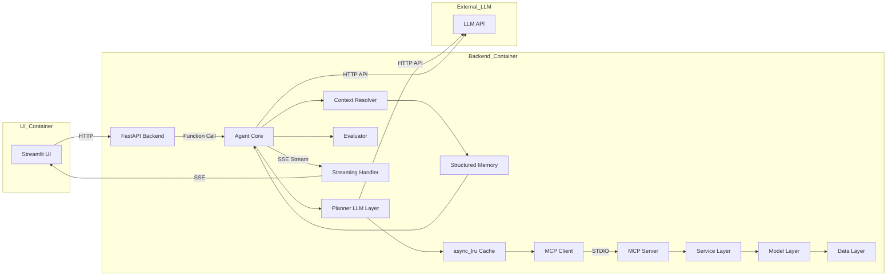
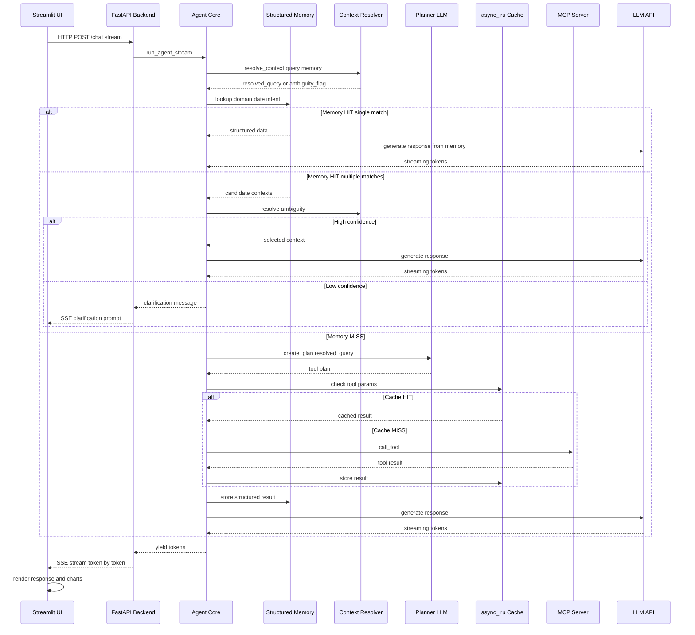
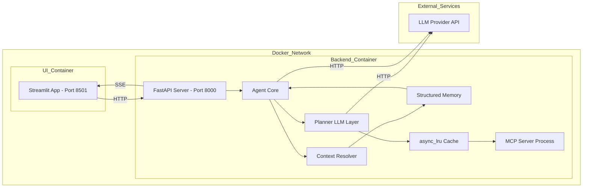
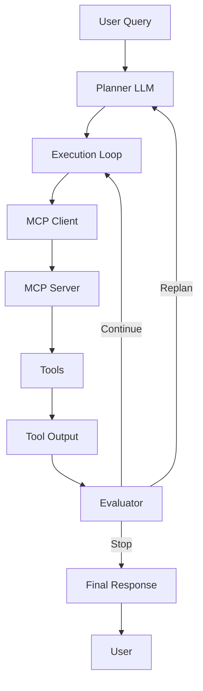

# ⚡ MCP-Based Energy AI Agent

An intelligent **energy analysis AI agent** powered by **ML models + Model Context Protocol (MCP)**.

This system implements a **production-grade, tool-augmented LLM architecture** with:

- ✅ Planner-driven execution  
- ✅ MCP-based tool orchestration  
- ✅ Evaluator loop (self-correction)  
- ✅ Deterministic tool control  
- ✅ Argument sanitization  
- ✅ Structured memory + Context-aware intelligence
- ✅ Spain-specific calibration  
- ✅ Dockerized multi-container deployment  

---

# 🚀 Overview

This project implements a **multi-stage AI agent system** capable of:

- Understanding natural language queries + Follow-up
- Planning execution using an LLM-based planner  
- Calling external tools (weather, energy, adjusted forecasts)  
- Streaming structured responses in real-time  
- Rendering analytics (charts, tables, metrics)  
- Forecasting solar energy production (Spain)  
- Analyzing weather impact on solar output  

---

## ✅ Improvements (NEW)
⚡ Faster responses (memory-first execution)
💰 Reduced cost (fewer tool + LLM calls)
🧠 True multi-turn reasoning
🔍 Accurate context resolution
❓ Safe ambiguity handling (no incorrect assumptions)

## ⚖️ Decision Strategy
---
| Scenario              | Action                   |
| --------------------- | ------------------------ |
| Memory HIT (single)   | Direct response (No MCP) |
| Memory HIT (multiple) | Resolve ambiguity        |
| Memory MISS           | Planner → Tool           |
| Repeated Tool Call    | Cache HIT (async_lru)    |

---
# 📈 Performance Impact

The introduction of **structured memory + context-aware execution** significantly improves system efficiency, latency, and cost.

---
## ⚡ Key Performance Gains

| Metric                    | Before (Tool-Driven)              | After (Memory-Driven)                | Impact |
|--------------------------|----------------------------------|--------------------------------------|--------|
| MCP Tool Calls           | Every query triggers tool call   | Only on memory/cache miss            | ↓ 40–80% |
| Response Latency         | High (LLM + MCP dependent)       | Low (memory-first execution)         | ↓ 30–70% |
| LLM Token Usage          | Higher (repeated planning)       | Reduced (context reuse)              | ↓ 20–50% |
| Duplicate Computation    | Frequent                         | Eliminated                           | ↓ ~100% |
| Context Awareness        | Stateless                        | Context-aware                        | ↑ Significant |
| Ambiguity Handling       | Not handled                      | Detected & resolved                  | ↑ Robust |
| Tool Call Accuracy       | May select incorrect tool        | Context-driven selection             | ↑ High |
| System Throughput        | Limited (more tool calls)        | Higher (fewer dependencies)          | ↑ Improved |
| External Dependency Load | High (frequent MCP calls)        | Reduced                              | ↓ Significant |

---
# 🐳 Multi-Container Architecture

The system is deployed using **two Docker containers**:

- **UI Container (Streamlit)**
- **Backend Container (FastAPI + Agent + MCP Client)**
---

## 🧩 Memory Architecture
🔹 L1: Execution Cache (async_lru)
Scope: Container lifetime
Purpose: Avoid duplicate tool calls
Type: Exact match

🔹 L2: Structured Memory (Session-Level)
Stores tool outputs with domain context
Enables:
Zero MCP Calls
Context-aware reasoning
Type: Semantic + structured lookup

🔹 L2: Structured Memory (Session-Level)
Stores tool outputs with domain context
Enables:
Zero MCP Calls
Context-aware reasoning
Type: Semantic + structured lookup
---

## 🧠 System Architecture Overview
High-level system design showing components and communication patterns.



## 🔁 Request Flow (Enhanced Memory + Context-Aware Execution)
Step-by-step execution from user query to response streaming.

<Sequence diagram>



## 🔹 New Runtime Components

| Component | Role |
|----------|------|
| Context Resolver | Determines query intent + follow-up |
| Structured Memory | Enables zero MCP call |
| Planner | Decides tool usage |
| Cache | Prevents duplicate execution |

## 🐳 Deployment Architecture
Container-level deployment and runtime boundaries.


# 🧩 System Components

## 🧠 Agent Layer

Core orchestration layer responsible for:

- Planning execution  
- Calling tools via MCP  
- Evaluating results  
- Generating final responses  

---

## 📋 Planner (LLM)

**Responsibilities:**

- Interpret user query  
- Select appropriate tools  
- Generate execution plan  

---

## 🔌 MCP Layer

### MCP Client
- Sends tool execution requests  
- Receives structured outputs  

### MCP Server
- Hosts tools  
- Executes domain logic  
- Returns structured responses  

---

## 🔁 Execution Flow (Previous)



---
## 🏗️ Execution Flow (NEW)

```mermaid
flowchart TD

    A[User Query] --> B[Context Resolver]

    B --> C[Structured Memory Lookup]

    C -->|Single Match| D[Direct Answer Generation]
    D --> Z[User Response]

    C -->|Multiple Matches| E[Ambiguity Resolver]

    E -->|LLM Confidence High| D
    E -->|Low Confidence| F[Ask User Clarification]
    F --> Z

    C -->|No Match| G[Planner (LLM)]

    G --> H[Tool Selection]
    H --> I[Tool Execution]

    I --> J[async_lru Cache]
    J --> K[MCP Server]

    K --> L[Tool Output]

    L --> M[Store in Structured Memory]
    M --> D
```

## 🛠️ MCP Tools

### 🌤️ Weather Forecast Tool
- Fetches weather data (Open-Meteo API)

### ⚡ Energy Forecast Tool
- Uses ML model (Unobserved Components)
- Predicts solar production

### 🔥 Adjusted Forecast Tool
- Combines weather + energy data  
- Applies adjustment logic  
- Produces final output  

---

## 🧠 Memory (Current State)

- Stores user + assistant messages  
- Used for UI rendering only  
- ❌ Not used in reasoning or planning  

---

## 🔁 Evaluator (Self-Correction)

- Detects incorrect plans  
- Triggers replanning  
- Ensures execution correctness  

---

## 🤖 ML Model Layer

- Pre-trained models (.pkl)
- Solar forecasting (Spain)

**Currently used:**
- Unobserved Components Model  

---

## ⚙️ Service Layer

- Forecast service  
- Weather service  
- Solar adjustment logic  

---

## 📊 Data Pipeline

Structured outputs from tools are used for:

- Charts  
- Tables  
- Metrics  
- CSV export  

---

## 🔄 Streaming Layer

**Protocol:** Server-Sent Events (SSE)

- Token-level streaming  
- Real-time UI updates  
- Metadata for analytics  

---

## 🧾 Logging

### Backend
- Rotating logs (`api.log`)  
- Structured logging  
- No duplication  

### UI
- File + console logs (`app.log`)  

---

## 🐳 Docker Setup

| Container | Description |
|----------|------------|
| UI       | Streamlit frontend |
| Backend  | FastAPI + Agent + MCP Client |

---

# 🔑 Engineering Decisions

### ✅ SSE over WebSockets
- Simpler infrastructure  
- Reliable for LLM streaming  

### ✅ MCP-Based Tooling
- Clean separation of concerns  
- Scalable tool ecosystem  

### ✅ Structured Extraction
- Deterministic UI rendering  
- No LLM dependency for analytics  

### ✅ Logging Design
- Rotating logs  
- Clean observability  

---

# 🔥 Key Features

- MCP-native tool execution  
- Multi-tool reasoning  
- Weather-aware solar forecasting  
- Self-correcting execution loop  
- SSE streaming (real-time responses)  
- Multi-container Docker architecture  
- Structured analytics pipeline  

---
## 🧠 Future Roadmap

- Seperate Docker containers for MCP client & MCP Server.
- Decoupling Multiple layers
- Further modularization

# 📁 Project Structure

```text
DATA-SCIENCE-AI/
│
├── agent/
│   ├── agent.py
│   └── context_resolver.py
│   ├── memory.py
│   └── planner.py
├── apps/
│   ├── cli/
│   ├── api/
│   └── ui/
├── mcp_core/
├── mcp_v2/
├── services/
├── models/
├── data/
│
├── docker-compose.yml
├── requirements.txt
└── README.md
```

---


# 📌 Important Note

> ⚠️ This is a **tool-augmented AI system**, not a traditional chatbot.

- Uses **LLM + MCP tools** instead of static responses  
- Analytics are generated from **structured tool outputs**  
- UI maintains session state for visualization  
- Backend operates **independently per user request**  
---

# 🏁 Summary

This system combines:

- 🧠 LLM reasoning  
- 🔌 MCP tool execution  
- ⚙️ Service orchestration  
- 🤖 ML forecasting  
- 📊 Real-time analytics  
- Before: Stateless, tool-dependent execution
- After: Context-aware, memory-driven intelligence

👉 Result: **A production-grade AI energy analysis agent**


