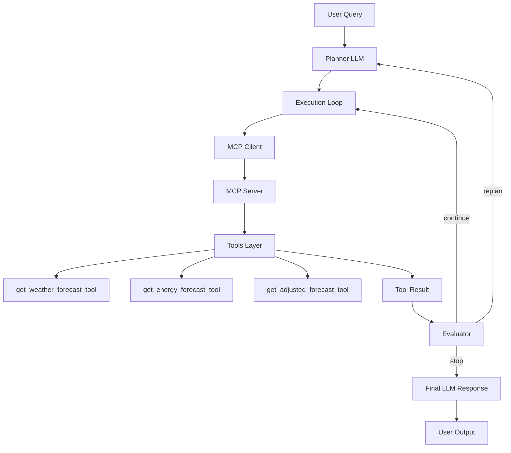

# data-science-ai
# ⚡ MCP-Based Energy AI Agent

An intelligent energy analysis agent built using **Model Context Protocol (MCP)** with:

- 🔁 Planner-driven reasoning
- 🧠 LLM-based decision making
- ⚙️ MCP tool execution
- 🔄 Self-correcting (replanning) architecture
- 🌤️ Weather-aware solar forecasting

---

# 🚀 Overview

This project implements a **multi-stage AI agent system** that can:

- Forecast solar energy production
- Analyze weather impact on solar output
- Combine multiple data sources intelligently
- Dynamically decide which tools to use
- Self-correct wrong decisions

---

# 🧠 Core Architecture
User Query
↓
Planner (LLM)
↓
Execution Loop
↓
MCP Client → MCP Server → Tools
↓
Evaluator (LLM + Rules)
↓
Replan (if needed)
↓
Final Response (LLM)

---

# 🧩 System Components

## 1. Planner (`agent/planner.py`)

**Responsibility:**
- Understand user query
- Select optimal tools
- Generate execution plan

## 2. MCP Layer

    . MCP Client
        - Sends tool execution request
        - Receives structured response
    . MCP Server (mcp_v2/server.py)
        - Registers tools
        - Executes business logic

## 3. Tools (MCP)
🌤️ get_weather_forecast_tool
        -Fetches weather data from Open-Meteo API
⚡ get_energy_forecast_tool
        -Uses ML model (UnobservedComponents)
        -Predicts solar production
🔥 get_adjusted_forecast_tool
        . Combines:
            -weather
            -solar forecast
        . Applies adjustment logic
        . Returns final production

## 4.  Final Reasoning (LLM)

After execution completes:

    -Interprets tool outputs
    -Generates human-readable explanation
    -Applies domain reasoning
## 5. 🧠 Key Design Principles
    | Component | Responsibility  |
    | --------- | --------------- |
    | Planner   | What to do      |
    | MCP       | Execute tools   |
    | Evaluator | Control flow    |
    | LLM       | Explain results |

## 6. Self-Correcting System
Wrong plan → evaluator detects → replan → continue

## 7. 🔥 Key Features
✅ MCP-native tool execution
✅ Multi-tool reasoning
✅ Weather-aware solar forecasting
✅ Self-correcting agent loop
✅ JSON-safe serialization
✅ Production-ready architecture

## 8. 🧠 Future Improvements
Parallel tool execution
Tool dependency graph
Confidence-based planning
FastAPI deployment
UI dashboard

## 9. API Architecture Flow

