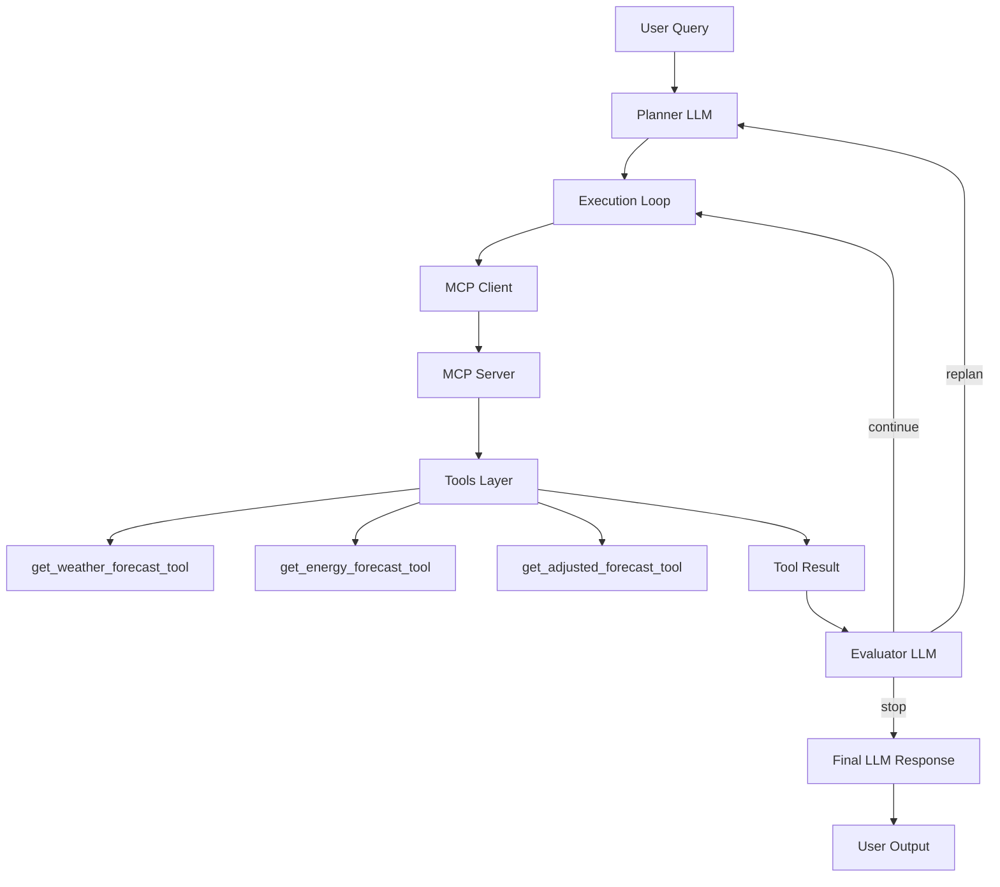

# data-science-ai
# ⚡ MCP-Based Energy AI Agent

An intelligent energy analysis agent backed by ML-Model, built using **Model Context Protocol (MCP)** :
This release introduces a production-grade MCP-native hybrid agent architecture with:

✔ Planner-driven execution
✔ MCP-based tool orchestration
✔ Evaluator loop (self-correction)
✔ Argument sanitization layer
✔ Deterministic tool control
✔ Location constraint handling (Spain-only system)
✔ Dockerized deployment

---

# 🚀 Overview

This project implements a **multi-stage AI agent system** that can:

- Understands natural language queries
- Plans execution using an LLM-based planner
- Calls external tools (weather, energy, adjusted forecasts)
- Streams structured + analytical responses
- Visualizes insights in real-time
- Forecast weather (Spain)
- Forecast solar energy production 
- Analyze weather impact on solar output
- Combine multiple data sources intelligently
- Dynamically decide which tools to use
- Self-correct wrong decisions
- This system has been calibarated for spain

---

## Multi Container Dockerization (NEW)
- The agent is fully containerized.
- Two containers used:
   1. UI Container
   2. Backend Container

# 🧠 Docker Container level Architecture

+---------------------------+        +--------------------------------------+
|        UI CONTAINER       |        |        BACKEND CONTAINER             |
|---------------------------|        |--------------------------------------|
| Streamlit (app.py)        |        | FastAPI (main.py)                    |
|                           |        |                                      |
| - Chat UI                 | <----> | - API Endpoints                      |
| - Streaming Renderer      |  HTTP  | - Agent Orchestration                |
| - Charts & Analytics      |        | - MCP Client                         |
|                           |        |                                      |
+---------------------------+        |  ┌──────────────────────────────┐    |
                                     |  │         AGENT LAYER          │    |
                                     |  │ (agent/ - planner, memory)   │    |
                                     |  └──────────────┬───────────────┘    |
                                     |                 │                    |
                                     |  ┌──────────────▼───────────────┐    |
                                     |  │       SERVICE LAYER          │    |
                                     |  │ (services/)                  │    |
                                     |  │ - forecast_service           │    |
                                     |  │ - weather_service            │    |
                                     |  │ - solar_adjustment_service   │    |
                                     |  └──────────────┬───────────────┘    |
                                     |                 │                    |
                                     |  ┌──────────────▼───────────────┐    |
                                     |  │        MODEL LAYER           │    |
                                     |  │ (models/)                    │    |
                                     |  │ - baseline                   │    |
                                     |  │ - energy                     │    |
                                     |  │ - nhits                      │    |
                                     |  │ - tcn                        │    |
                                     |  └──────────────┬───────────────┘    |
                                     |                 │                    |
                                     |  ┌──────────────▼───────────────┐    |
                                     |  │        DATA LAYER            │    |
                                     |  │ (data/, loaders)             │    |
                                     |  └──────────────────────────────┘    |
                                     |                                      |
                                     +------------------+-------------------+
                                                        |
                                                        | STDIO (MCP)
                                                        ▼
                                           +-----------------------------+
                                           |      MCP SERVER             |
                                           |-----------------------------|
                                           | mcp_v2.server               |
                                           |                             |
                                           | Tools:                      |
                                           | - Weather Forecast          |
                                           | - Energy Forecast           |
                                           | - Adjusted Forecast         |
                                           +-----------------------------+

---

# 🧩 System Components

## 1. Planner (`agent/planner.py`)

**Responsibility:**
- Understand user query
- Select optimal tools
- Generate execution plan

## 2. MCP Flow/Layer with Core Achitectural Flow

                                          User Query
                                             ↓
                                          Agent (Planner + Executor + Evaluator/Self Correction)
                                             ↓
                                          MCP Client (Consumes Tool)
                                             ↓
                                          MCP Server (Exposes Tool)
                                             ↓
                                          Service Layer 
                                             ↓
                                          Model Layer (Pre-built ML Models)
                                             ↓
                                          Data Layer
                                             ↓
                                          Response → Agent → UI(Streamlit UI)

    . MCP Client
        - Sends tool execution request
        - Receives structured response
    . MCP Server (mcp_v2/server.py)
        - Registers tools
        - Executes business logic

## Argument Sanitization Layer (NEW)
LLM may generate invalid arguments based on the user query- since this system is designed on Spain data
User will get the prompt even if user enquire abotu the other location. That why before calling this layer
sanitize the input to the tools.

## 3. Tools (MCP)
🌤️ get_weather_forecast_tool
        -Fetches weather data from Open-Meteo API
⚡ get_energy_forecast_tool
        -Uses ML model (UnobservedComponents)
        -Predicts solar production
🔥 get_adjusted_forecast_tool
        . Combines:
            -weather
            -solar forecast
        . Applies adjustment logic
        . Returns final production

## 4.  Final Reasoning (LLM)

After execution completes:

    -Interprets tool outputs
    -Generates human-readable explanation
    -Applies domain reasoning
    
## 5. 🧠 Key Design Principles
    +----------------------------------------+
    | Component        | Responsibility      |
    ------------------------------------------
    | Planner          | What to do          |
    | MCP              | Execute tools       |
    | Evaluator        | Control flow        |
    | LLM              | Explain results     |
    | Memory           | UI Memory(Session)  |
    +----------------------------------------+

## 🔑 Engineering Decisions
✅ SSE over WebSockets
   - Simpler infra
   - Reliable streaming
   - Works with HTTP stack
✅ MCP-based Tooling
   - Clean separation of concerns
   - Scalable tool ecosystem
✅ Structured Extraction
   - Deterministic UI rendering
   - No LLM dependency for charts
✅ Logging Design
   - Rotating logs
   - No duplicate logs

## 6. Self-Correcting System
Wrong plan → evaluator detects → replan → continue

## 7. 🔥 Key Features
✅ MCP-native tool execution
✅ Multi-tool reasoning
✅ Weather-aware solar forecasting
✅ Self-correcting agent loop
✅ JSON-safe serialization
✅ SSE Streaming (Agent Engine Level- Unidirectional LLM Streaming Tokenwise LLM-->UI)
✅ MCP client lifecycle management
✅ Multi container (Docker) communication
✅ Strucured data pipeline (Tool Response) used for Charts,Tables,Metrics & CSV Export
✅ Production-ready architecture

## 9. API Architecture Flow

## 8. 🧠 Future Roadmap

   🔹 1. Tool Memory Layer:
         - Cache tool outputs
         - Reuse across queries
   🔹 2. Memory-Aware Planning:
         - Planner agent is aware of previous tool call/s output uses for the next queries
           during the session context/browser context
         - Minimize tool call
         - No MCP Call (Faster response)
         - Cost: Fewer LLM + Toll Token
         Current Behaviour:
            User: solar forecast tomorrow
               → tool called ✅

            User: what is peak production?
               → tool called AGAIN ❌ (wasteful)
   🔹 3. Smart Context Injection:
         - Summarized memory
         - Reduced token usage
   🔹 4. Multi-Turn Reasoning
         - Context-aware follow-ups
         - Cross-query intelligence

## Note
This project may contain some extra files as it is the outcome of a transition from an MCP implementation in Python to using readily available FastMCP libraries. For better understanding of the files included in the project scope, please refer to the imports used in the code. Some of them are mentioned below:
- mcp_core: This folder is not used in the current project scope.
- tools: This folder has not been used in the project so far, but it has been retained for future scope.
- services: This folder contains an unused file named data_loader.py, which can be utilized for future enhancements.
- models: This folder contains multiple subfolders named after different model algorithms tested for solar energy forecasting (Spain). However, within the project scope, only the UnobservedComponentModel has been used, located inside models/energy/solar_forecast. The objective of this project is to develop an agent prototype that integrates MCP with the energy forecast model.
- test: Completely unused folder as of now.
- data: Reserved for future scope.

