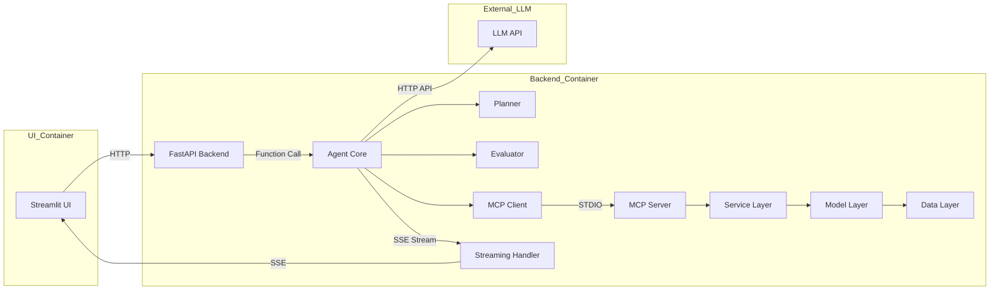
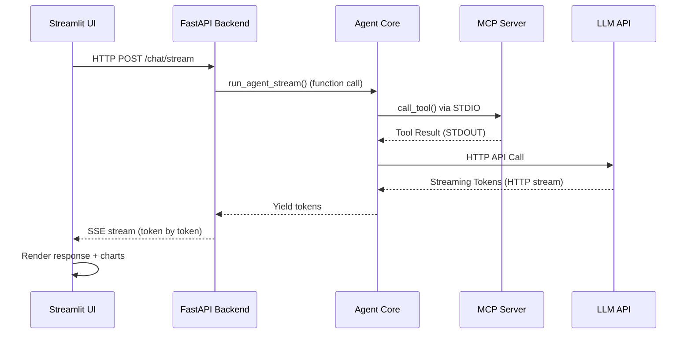
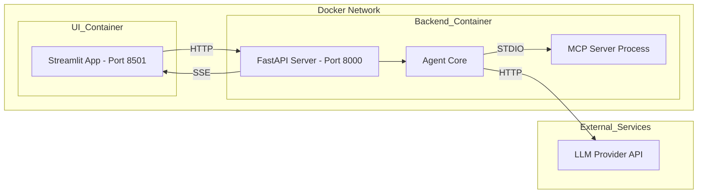
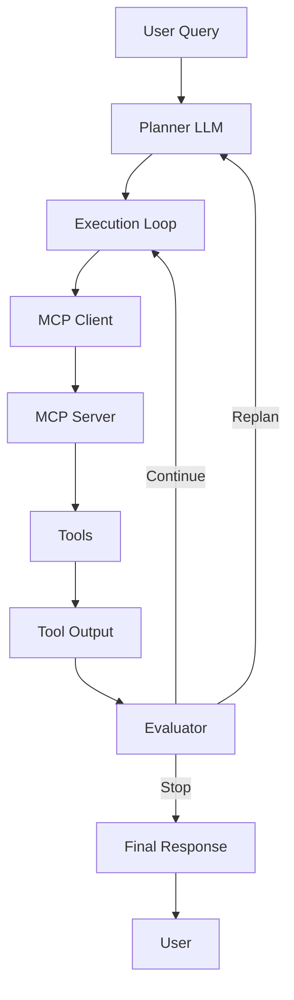

# ⚡ MCP-Based Energy AI Agent

An intelligent **energy analysis AI agent** powered by **ML models + Model Context Protocol (MCP)**.

This system implements a **production-grade, tool-augmented LLM architecture** with:

- ✅ Planner-driven execution  
- ✅ MCP-based tool orchestration  
- ✅ Evaluator loop (self-correction)  
- ✅ Deterministic tool control  
- ✅ Argument sanitization  
- ✅ Spain-specific calibration  
- ✅ Dockerized multi-container deployment  

---

# 🚀 Overview

This project implements a **multi-stage AI agent system** capable of:

- Understanding natural language queries  
- Planning execution using an LLM-based planner  
- Calling external tools (weather, energy, adjusted forecasts)  
- Streaming structured responses in real-time  
- Rendering analytics (charts, tables, metrics)  
- Forecasting solar energy production (Spain)  
- Analyzing weather impact on solar output  

---

# 🐳 Multi-Container Architecture

The system is deployed using **two Docker containers**:

- **UI Container (Streamlit)**
- **Backend Container (FastAPI + Agent + MCP Client)**

---

## 🧠 System Architecture Overview
High-level system design showing components and communication patterns.

<High-level architecture diagram>



## 🔁 Request Flow (Sequence Diagram)
Step-by-step execution from user query to response streaming.

<Sequence diagram>


## 🐳 Deployment Architecture
Container-level deployment and runtime boundaries.

<Deployment diagram>


# 🧩 System Components

## 🧠 Agent Layer

Core orchestration layer responsible for:

- Planning execution  
- Calling tools via MCP  
- Evaluating results  
- Generating final responses  

---

## 📋 Planner (LLM)

**Responsibilities:**

- Interpret user query  
- Select appropriate tools  
- Generate execution plan  

---

## 🔌 MCP Layer

### MCP Client
- Sends tool execution requests  
- Receives structured outputs  

### MCP Server
- Hosts tools  
- Executes domain logic  
- Returns structured responses  

---

## 🔁 Execution Flow



---

## 🛠️ MCP Tools

### 🌤️ Weather Forecast Tool
- Fetches weather data (Open-Meteo API)

### ⚡ Energy Forecast Tool
- Uses ML model (Unobserved Components)
- Predicts solar production

### 🔥 Adjusted Forecast Tool
- Combines weather + energy data  
- Applies adjustment logic  
- Produces final output  

---

## 🧠 Memory (Current State)

- Stores user + assistant messages  
- Used for UI rendering only  
- ❌ Not used in reasoning or planning  

---

## 🔁 Evaluator (Self-Correction)

- Detects incorrect plans  
- Triggers replanning  
- Ensures execution correctness  

---

## 🤖 ML Model Layer

- Pre-trained models (.pkl)
- Solar forecasting (Spain)

**Currently used:**
- Unobserved Components Model  

---

## ⚙️ Service Layer

- Forecast service  
- Weather service  
- Solar adjustment logic  

---

## 📊 Data Pipeline

Structured outputs from tools are used for:

- Charts  
- Tables  
- Metrics  
- CSV export  

---

## 🔄 Streaming Layer

**Protocol:** Server-Sent Events (SSE)

- Token-level streaming  
- Real-time UI updates  
- Metadata for analytics  

---

## 🧾 Logging

### Backend
- Rotating logs (`api.log`)  
- Structured logging  
- No duplication  

### UI
- File + console logs (`app.log`)  

---

## 🐳 Docker Setup

| Container | Description |
|----------|------------|
| UI       | Streamlit frontend |
| Backend  | FastAPI + Agent + MCP Client |

---

# 🔑 Engineering Decisions

### ✅ SSE over WebSockets
- Simpler infrastructure  
- Reliable for LLM streaming  

### ✅ MCP-Based Tooling
- Clean separation of concerns  
- Scalable tool ecosystem  

### ✅ Structured Extraction
- Deterministic UI rendering  
- No LLM dependency for analytics  

### ✅ Logging Design
- Rotating logs  
- Clean observability  

---

# 🔥 Key Features

- MCP-native tool execution  
- Multi-tool reasoning  
- Weather-aware solar forecasting  
- Self-correcting execution loop  
- SSE streaming (real-time responses)  
- Multi-container Docker architecture  
- Structured analytics pipeline  

---
## 🧠 Future Roadmap

   🔹 1. Tool Memory Layer:
         - Cache tool outputs
         - Reuse across queries
   🔹 2. Memory-Aware Planning:
         - Planner agent is aware of previous tool call/s output uses for the next queries
           during the session context/browser context
         - Minimize tool call
         - No MCP Call (Faster response)
         - Cost: Fewer LLM + Toll Token
         Current Behaviour:
            User: solar forecast tomorrow
               → tool called ✅

            User: what is peak production?
               → tool called AGAIN ❌ (wasteful)
   🔹 3. Smart Context Injection:
         - Summarized memory
         - Reduced token usage
   🔹 4. Multi-Turn Reasoning
         - Context-aware follow-ups
         - Cross-query intelligence

# 📁 Project Structure

```text
DATA-SCIENCE-AI/
│
├── agent/
├── apps/
│   ├── api/
│   └── ui/
├── mcp_core/
├── mcp_v2/
├── services/
├── models/
├── data/
│
├── docker-compose.yml
├── requirements.txt
└── README.md
```

---


# 📌 Important Note

> ⚠️ This is a **tool-augmented AI system**, not a traditional chatbot.

- Uses **LLM + MCP tools** instead of static responses  
- Analytics are generated from **structured tool outputs**  
- UI maintains session state for visualization  
- Backend operates **independently per request**  

---

# 🏁 Summary

This system combines:

- 🧠 LLM reasoning  
- 🔌 MCP tool execution  
- ⚙️ Service orchestration  
- 🤖 ML forecasting  
- 📊 Real-time analytics  

👉 Result: **A production-grade AI energy analysis agent**


